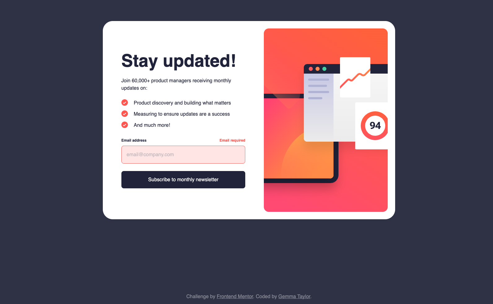
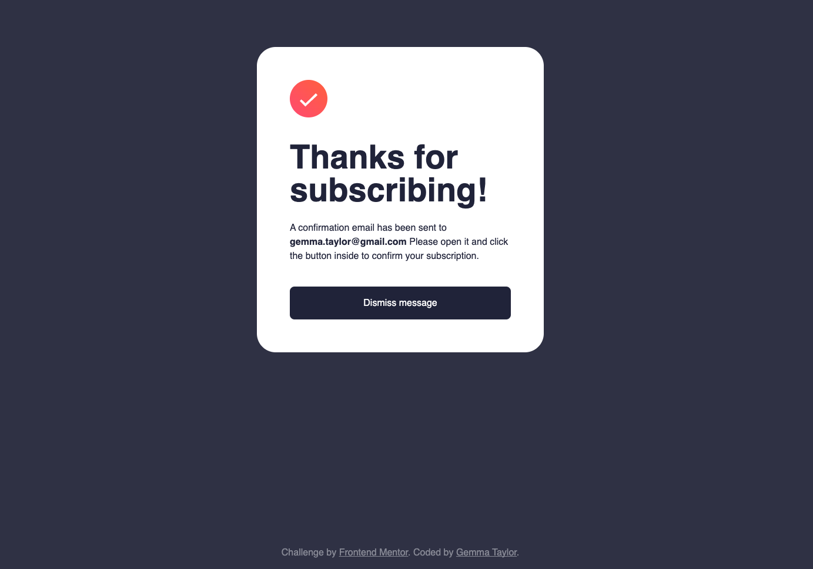
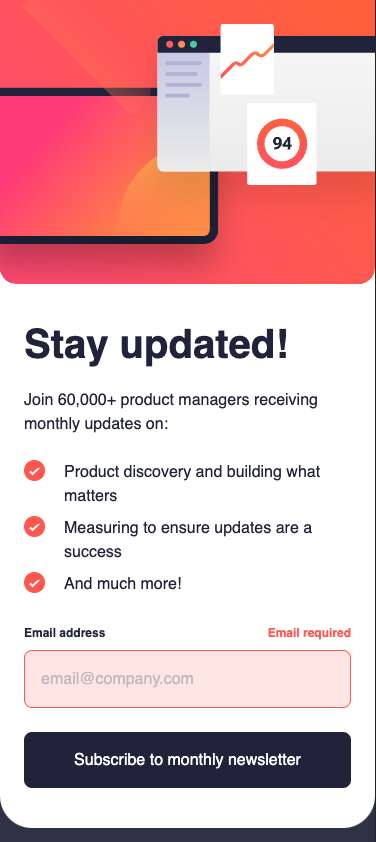

# Frontend Mentor - Newsletter sign-up form with success message solution

This is a solution to the [Newsletter sign-up form with success message challenge on Frontend Mentor](https://www.frontendmentor.io/challenges/newsletter-signup-form-with-success-message-3FC1AZbNrv). Frontend Mentor challenges help you improve your coding skills by building realistic projects.

## Table of contents

- [Overview](#overview)
  - [The challenge](#the-challenge)
  - [Screenshot](#screenshot)
  - [Project Setup](#project-setup)
  - [Links](#links)
- [My process](#my-process)
  - [Built with](#built-with)
  - [What I learned](#what-i-learned)
  - [Continued development](#continued-development)
  - [Useful resources](#useful-resources)
- [Author](#author)

## Overview

### The challenge

Users should be able to:

- Add their email and submit the form
- See a success message with their email after successfully submitting the form
- See form validation messages if:
  - The field is left empty
  - The email address is not formatted correctly
- View the optimal layout for the interface depending on their device's screen size
- See hover and focus states for all interactive elements on the page

### Screenshot






### Project Setup

```sh
npm install
```

#### Compile and Hot-Reload for Development

```sh
npm run dev
```

#### Compile and Minify for Production

```sh
npm run build
```

### Links

- Solution URL: [Add solution URL here](pending frontend mentor solution upload)
- Live Site URL: [https://gemtay.github.io/newsletter-signup-form/home](https://gemtay.github.io/newsletter-signup-form/home)

## My process

### Built with

- Semantic HTML5 markup
- CSS custom properties
- Flexbox
- CSS Grid
- Mobile-first workflow
- [Vue.js](https://vuejs.org/) - Vue framework

### What I learned

This project was my first time using Vue and I was pleseantly surprised at just how easy it was to setup and use. It might be over-kill for this small of a challenge however I wanted to tackle the form validation properly with server-side validation, and also setup the success view as a seperate page rather than a component that is shown and hidden with CSS & JS.

#### Setting up view components & routes

1. I defined my view components in `Home.vue` and `SubscriptionSuccess.vue`.

2. The next step was setting up routes, which was super quick and easy by simply defining them in my `index.js` file and hooking them up to each view component.

3. Finally I added `<router-view/>` to my `App.vue` template which tells the Vue router where to render the current route component. That's the component that corresponds to the current URL path.

#### Adding form validation with Vue composition API

1. Install Vuelidate core and validators
```sh
npm install @vuelidate/core @vuelidate/validators
```

2. Define the form data and validation rules

Create a reactive component of the form data. Vue's reactivity system means that when you modify components, the view updates.

```js
const state = reactive({
  email: "",
})
```

Here I defined validatation rules on the email field.
`rules` needs to be a `computed()` property to allow it access to reactive data e.g the `state.email` value. I made use of the `helpers` component to customise the error messages to match the design.

```js
const rules = computed(() => {
  return {
      email: {
        required: helpers.withMessage("Email required", required),
        email: helpers.withMessage("Valid email required", email),
      },
  };
});
```

3. Activate Vuelidate by calling `useVuelidate` and passing the rules and state:

```js
const v$ = useValidate(rules, state);
```

4. Validate the form data on submit, and if the data is valid, redirect the user to the success page, passing their email as a query parameter:

```html
<form @submit.prevent="submitForm"
```
```js
methods: {
    submitForm() {
      this.v$.$validate();
      if (!this.v$.$error) {
        this.$router.push({ path: "/subscription-success", query: { email: this.state.email }});
      };
    }
  }
```

### Continued development

As previously mentioned, this was my first time using Vue, therefore I would love to attempt more challenges which will require me to make the most of what it offers

### Useful resources

- [Vue router documentation](https://router.vuejs.org/) - This helped me understand how to setup routing
- [Vuelidate documentation](https://vuelidate-next.netlify.app/) - This helped me tackle the form validation
- [Video tutorial on Vuelidate](https://www.youtube.com/watch?v=2BR6Vvjw3wQ&t=307s)

## Author

- Personal Website - [pending...](#)
- Frontend Mentor - [@GemTay](https://www.frontendmentor.io/profile/GemTay)
